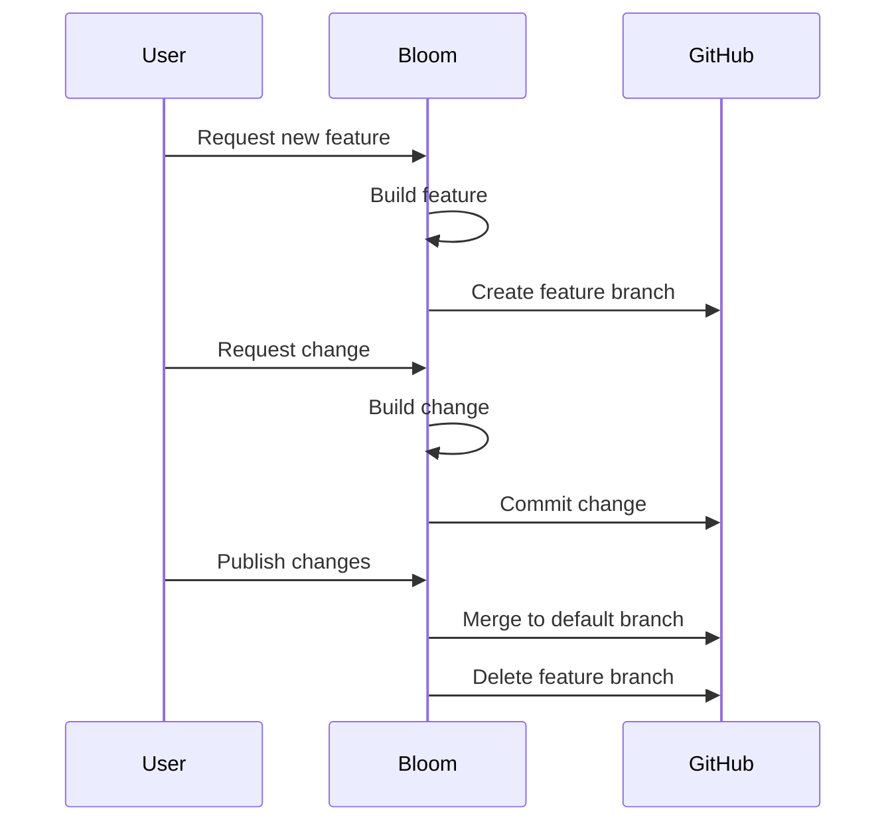

import { CardList, Prerequisites, InProductAction, Kbd, getOsShortcut } from "docs-ui"

export const metadata = {
  title: `Sync with GitHub`,
}

# {metadata.title}

You have full ownership over your Bloom store's code. Export your Bloom project to GitHub for advanced development with full IDE features, version control, and team collaboration.

After exporting, you can continue using Bloom to build features while developing locally. Bloom automatically syncs changes from GitHub, maintaining a seamless workflow between local development and AI-powered building.

<Prerequisites
  items={[
    {
      text: "Bloom Hobby Plan",
      link: "/credits-and-plans",
    },
    {
      text: "GitHub Account",
      link: "https://github.com",
    },
  ]}
/>

## How to Export Your Project to GitHub

To export your Bloom project to GitHub, you need to open the <InProductAction product={"bloom"} type={"MEDUSA_AI_OPEN_PANE"} data={{ pane: "github" }}>**GitHub tab**</InProductAction>:

1. Press <Kbd>{getOsShortcut()}</Kbd> + <Kbd>k</Kbd> to open the preview tab switcher.
2. Select the "Sync with GitHub" tab from the list.

This will open the Sync with GitHub page where you can connect your GitHub account and transfer your repository.

{/* TODO: Screenshot of GitHub integration page */}

### 1. Connect GitHub Account

If you signed up for Bloom with GitHub, you can skip this step as your account is already connected. This step is required for users who signed up with email.

To connect your GitHub account, click the "Connect" button and authorize Bloom to access your GitHub account. A new page will open on GitHub to give Bloom the necessary permissions.

<Note title="Tip">

If you're transferring to a GitHub organization, make sure to give Bloom access to that organization during the authorization process.

</Note>

Once you've authorized Bloom, you'll be taken back to the GitHub form in Bloom where you can proceed with the repository transfer.

### 2. Transfer Repository

After connecting your GitHub account, you can transfer your Bloom project to your GitHub account. Bloom creates a new repository in your GitHub account with the full codebase and commit history of your Bloom project.

To transfer the repository, choose the GitHub account or organization where you want the repository to be created. Then, click the "Transfer" button to start the transfer process.

<Note title="Tip">

If you don't see your GitHub organization in the dropdown, click the "Configure integration" link to manage your GitHub integration settings. Make sure you've given Bloom access to the organization you want to transfer to.

</Note>

Bloom will create a new repository in your GitHub account with the same name as your Bloom project. The repository includes all code, commit history, and branches from your Bloom project.

### 3. Access Your Repository

Once the transfer is complete, you'll see a "Repository Information" section with a button to view the repository on GitHub. Click the "View Repository" button to open your new repository on GitHub.

The repository contains the full codebase of your Bloom project, organized in a monorepo structure with `backend` and `storefront` directories. You can clone the repository to your local machine, make changes, and push updates to GitHub.

<Note title="Tip">

See [Project Structure](../code-editor/page.mdx#project-structure) in the Code Editor guide for an overview of the codebase structure and key files in your Bloom project.

</Note>

---

## Collaborating with Bloom After Export

Before publishing your store, Bloom works directly on the default branch (usually `main` or `master`). After publishing, Bloom uses a branching workflow:



1. When you ask for a feature or change, Bloom creates a new branch with an auto-generated name matching the feature Bloom is building (for example, `add-product-reviews-feature`).
2. When you ask for changes after that, Bloom makes the changes on that branch and commits them with descriptive messages.
3. When you publish the changes to the live store, Bloom will merge the branch into the default branch and delete the feature branch.

So, if you're also building features outside of Bloom, make sure to:

1. Pull the latest changes from the default branch before starting new work to avoid conflicts with published changes from Bloom.
2. When working on a new feature, create a new branch from the default branch to keep your work organized, then merge back into the default branch when your feature is ready to go live.
3. When working on the same feature as Bloom, change to the feature branch that Bloom is using and make your changes there. This way, you can collaborate with Bloom on the same feature without conflicts. 

### Provide Context for Manual Changes

When you make changes to the codebase outside of Bloom and you want to continue building with Bloom, provide context to Bloom about the changes you've made.

This helps Bloom understand your codebase and avoid conflicts when building new features or making changes.

For example, if you integrated a new payment provider in the backend and you want Bloom to make the necessary changes in the storefront, ask Bloom:

```bash
I integrated PayPal as a new payment provider in the backend. The integration is in a new module called "paypal".
Update the storefront to support PayPal as a payment option during checkout.
```

Bloom will analyze the changes you made in the backend, understand the new "paypal" module, and make the necessary updates in the storefront to support PayPal during checkout.

### Restore Changes Limitations

The [Restore Changes](../../features/restore-changes/page.mdx) feature only works for changes made by Bloom. Changes you make outside of Bloom cannot be restored using this feature.

To revert manual changes, use GitHub's version control features like `git revert` or `git reset`.

---

## Files to Avoid Editing

While you have complete ownership over your Bloom project's code, if you want to continue using Bloom to build features and make changes, it's highly recommended to avoid making changes to the following files:

1. Root configuration files: `package.json`, `turbo.json`, and any other configuration files at the root level of the project. Changes to these files can affect how Bloom builds and runs your project, potentially causing unexpected behavior.
2. `package.json` scripts: Avoid changing the scripts in `package.json`, especially those related to building and running the project. These scripts are used by Bloom to execute tasks, and changes can interfere with Bloom's ability to manage your project effectively.
3. `vite.config.ts` plugins: The default Vite configuration includes plugins that Bloom relies on to build and deploy your storefront. Avoid removing or changing these plugins to ensure Bloom can continue to build and deploy your storefront correctly.
4. `medusa-config.ts` admin configurations: The `medusa-config.ts` file includes configurations for the Medusa Admin dashboard to ensure it works correctly with Bloom's features. Avoid changing admin-related configurations to prevent issues with previewing the admin dashboard.

---

## FAQ

### Can I transfer the repository back to Bloom?

No, repository transfer is one-way. Once transferred to GitHub, the repository remains in your GitHub account.

However, you can continue using Bloom after transfer. Bloom automatically syncs changes from GitHub. You can still prompt Bloom to build features.

### What happens to my Bloom project after export?

Your Bloom project remains fully functional after export. You can continue using Bloom to build features and make changes to your store.

### Can I collaborate with team members after export?

Yes, your team can continue collaborating on the project after export. They can make changes to the GitHub repository if they have access, or use Bloom to build features and make changes without accessing the codebase.

### Can I export to a GitHub organization?

Yes, you can export to a GitHub organization during the transfer process. Make sure to give Bloom access to the organization during the GitHub authorization step. Then, when transferring the repository, select the organization as the destination.

---

## Development Resources

Check out the documentation for the key technologies powering your Bloom project.

<CardList
  items={[
    {
      title: "Medusa Documentation",
      text: "Learn about Medusa's architecture, development patterns, and how to customize the backend and admin dashboard.",
      href: "!docs!",
    },
    {
      title: "TanStack Start Documentation",
      text: "Learn about routing, data fetching, server functions, and performance optimization for your storefront.",
      href: "https://tanstack.com/start/latest",
    },
    {
      title: "Vite Documentation",
      text: "Learn about Vite's features, configuration options, and how to optimize your development and build process.",
      href: "https://vitejs.dev/guide/",
    },
    {
      title: "Turborepo Documentation",
      text: "Learn about monorepo management, task running, and how to optimize your development workflow.",
      href: "https://turborepo.dev/"
    }
  ]}
  itemsPerRow={1}
/>
